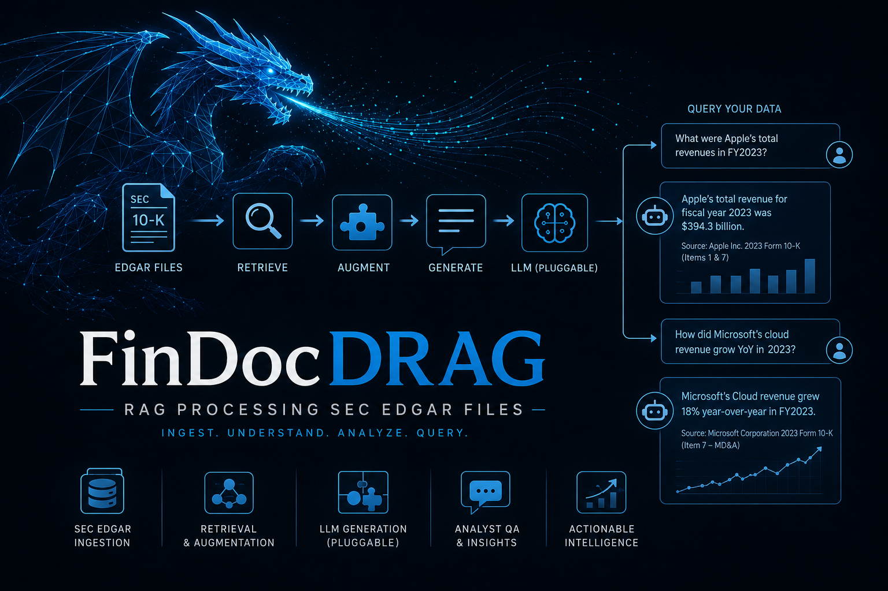

[English](README.md)

<p align="center">
  
</p>

# FinDoc RAG

金融ドキュメントインテリジェンスのための Retrieval-Augmented Generation プラットフォームです。FinDoc RAG は SEC の 10-K 提出書類を取り込み、チャンクに分割してベクターストアに埋め込み、引用元付きで自然言語の質問に回答する REST API を公開します。

## 概要

このシステムは、Apache Kafka と pgvector 拡張を持つ共有 PostgreSQL データベースで接続された、独立してデプロイ可能な 3 つのサービスで構成されています。

- **Ingestion Service** -- SEC EDGAR 全文検索 API から 10-K 提出書類を取得し、未加工の提出テキストを Kafka にパブリッシュします。
- **Embedding Worker** -- Kafka から未加工の提出書類を消費し、セクションを考慮したチャンクに分割し、密なベクター埋め込みを生成して、結果を pgvector に格納します。チャンク分割は階層的に行われます。10-K の各項目をセクション（Item 1A、Item 7 など）で分割し、次に段落で分割し、最後に 64 トークンのオーバーラップを持つ 512 トークンのウィンドウに分割します。各チャンクにはセクション名、ティッカー、提出日、決定論的な SHA256 チャンク ID が保持されます。
- **Query API** -- 自然言語の質問を受け付け、クエリを埋め込んでコサイン距離で候補チャンクを検索し、Maximal Marginal Relevance (MMR) リランキングで関連性と多様性のバランスを取り、根拠のあるプロンプトを構築し、引用元付きの LLM 生成回答を返します。

```
SEC EDGAR  -->  Ingestion  -->  Kafka  -->  Embedding Worker  -->  PostgreSQL + pgvector
                                                                         ^
API Client  <-->  Query API  <-->  Ollama / OpenAI / Claude              |
                                      |                                  |
                                      +----------------------------------+
```

## 前提条件

- [Docker](https://docs.docker.com/get-docker/) と [Docker Compose](https://docs.docker.com/compose/install/)（v2 以降）
- Python 3.12 以降（ローカル開発および Docker 外でのテスト実行用）
- GNU Make（任意、便利なターゲット用）

**ハードウェア：** 本スタックは実行するマシンに合わせてサイズを調整できます。コンテナの CPU およびメモリ上限、埋め込みのバッチサイズ、Ollama のコンテキストウィンドウはすべて環境変数です（[設定](#設定)を参照）。手持ちのハードウェアに合わせてスケールしてください。必要なリソースは、選択する LLM バックエンドにほぼ完全に依存します。`LLM_BACKEND=claude` または `openai` を指定した `make run-remote` はローカル推論を一切行いません。一方、ローカル LLM パスは選択したモデルによって決まります。

ローカルでベンチマークを取る前に知っておくべき注意点が 1 つあります。**macOS および Windows では、コンテナ化された Ollama は CPU のみで動作します**。Docker の Linux VM はホストの GPU にアクセスできないためです。ローカル生成を大幅に高速化するには、ホスト上で Ollama をネイティブに実行し、`OLLAMA_URL` をそこに向けてください。[LLM バックエンド](#llm-バックエンド)を参照してください。

## クイックスタート

1. リポジトリをクローンし、環境テンプレートをコピーします。

```bash
git clone https://github.com/drag0sd0g/FinDocDRAG.git
cd FinDocDRAG
cp .env.example .env
```

2. `.env` を確認し、`EDGAR_USER_AGENT` にご自身を識別する値を設定します（SEC は名前と連絡先メールアドレスを要求します）。

```
EDGAR_USER_AGENT=YourName your.email@example.com
```

3. フルスタックを起動します。

```bash
# Ollama を使用する場合（ローカル LLM、API キー不要）:
make run
# または: docker compose --profile local-llm up --build

# リモート LLM を使用する場合（Claude または OpenAI、GPU/RAM 不要）:
export LLM_BACKEND=claude          # または: export LLM_BACKEND=openai
export ANTHROPIC_API_KEY=sk-ant-…  # または: export OPENAI_API_KEY=sk-…
make run-remote
# または: docker compose up --build
```

初回起動時は、コンテナイメージのプル、3 つのサービスのビルド、データベースマイグレーションの実行が行われます。スキーマは `db/migrations/001_initial_schema.sql` から自動的に適用されます（`pgvector` 拡張、`ingestion_log` テーブル、`document_chunks` テーブル、HNSW ベクターインデックスを作成します）。マイグレーションを手動で実行するには：`make migrate`

Ollama を使用する場合（`make run`）、`OLLAMA_MODEL` で指定したモデルが初回起動時に自動的にダウンロードされます。2 回目以降の起動ではキャッシュされたレイヤーとボリュームが再利用されます。

4. サービスが起動していることを確認します。

```bash
curl http://localhost:8001/health   # Ingestion Service
curl http://localhost:8002/health   # Embedding Worker
curl http://localhost:8000/health   # Query API
```

## 使い方

### 提出書類の取り込み

特定のティッカーの取り込みをトリガーします。

```bash
curl -X POST http://localhost:8001/v1/ingest \
  -H "Content-Type: application/json" \
  -d '{"tickers": ["AAPL", "MSFT"]}'
```

ボディが指定されない場合、サービスは `config/tickers.yml` から読み込みます。

### ナレッジベースへのクエリ

```bash
curl -X POST http://localhost:8000/v1/query \
  -H "Content-Type: application/json" \
  -H "X-API-Key: dev-key-1" \
  -d '{
    "question": "What were Apple'\''s main risk factors related to supply chain in their 2024 10-K?",
    "ticker_filter": "AAPL",
    "top_k": 5
  }'
```

`top_k` は省略可能です（デフォルト `5`、範囲 `1`–`20`）。`X-Request-ID` ヘッダーを含めるとログエントリ間でリクエストを追跡できます。省略した場合は自動生成され、レスポンスの `request_id` として返されます。

レスポンスの形式：

```json
{
  "answer": "Apple's 2024 10-K identifies supply chain concentration as a key risk...",
  "sources": [
    {
      "chunk_id": "a1b2c3d4e5f6...",
      "ticker": "AAPL",
      "filing_date": "2024-11-01",
      "section": "Item 1A - Risk Factors",
      "relevance_score": 0.87,
      "text_preview": "The Company's operations and performance depend significantly on..."
    }
  ],
  "model": "mistral:7b",
  "timing": {
    "embedding_ms": 12.4,
    "retrieval_ms": 38.1,
    "generation_ms": 4821.0,
    "total_ms": 4871.5
  },
  "degraded": false,
  "request_id": "550e8400-e29b-41d4-a716-446655440000"
}
```

LLM が利用できない場合、`answer` は `null`、`degraded` は `true` になります（HTTP 200 -- [グレースフルデグラデーション](#グレースフルデグラデーション)を参照）。

### 取り込み済みドキュメントの一覧表示

```bash
curl http://localhost:8000/v1/documents \
  -H "X-API-Key: dev-key-1"
```

オプションのクエリパラメータ `ticker`、`limit`、`offset` をサポートします。

### インタラクティブ API ドキュメント

FastAPI は OpenAPI 3.0 ドキュメントを自動生成します。3 つのサービスすべてが起動中に公開します。

| サービス          | Swagger UI                 | ReDoc                       | JSON スペック                      |
| ----------------- | -------------------------- | --------------------------- | ---------------------------------- |
| Query API         | http://localhost:8000/docs | http://localhost:8000/redoc | http://localhost:8000/openapi.json |
| Ingestion Service | http://localhost:8001/docs | http://localhost:8001/redoc | http://localhost:8001/openapi.json |
| Embedding Worker  | http://localhost:8002/docs | http://localhost:8002/redoc | http://localhost:8002/openapi.json |

スタックを起動せずに静的スペックをエクスポートするには：

```bash
cd services/query-api
PYTHONPATH=. python -c "import json; from src.main import app; print(json.dumps(app.openapi(), indent=2))"
```

## プロジェクト構成

```
findoc-rag/
  config/tickers.yml              取り込むティッカー（FR-2）
  db/migrations/                  PostgreSQL スキーマ（pgvector）
  services/
    ingestion/                    SEC EDGAR フェッチャー + Kafka プロデューサー
    embedding-worker/             チャンカー + sentence-transformers + pgvector ライター
    query-api/                    RAG パイプライン: リトリーバー、プロンプトビルダー、LLM バックエンド
    eval/                         評価ハーネス（ragas）
  helm/findoc-rag/                Kubernetes Helm チャート
  monitoring/                     Prometheus 設定 + Grafana ダッシュボード
  docs/
    technical-design-document.md  完全な TDD（アーキテクチャ、要件、設計判断）
    design-decisions.md           ADR とトレードオフ分析
    evaluation-results.md         RAG 品質メトリクス
  docker-compose.yml              ローカルフルスタックのオーケストレーション
  Makefile                        開発ワークフローターゲット
```

## 開発

### ローカルセットアップ（Docker なし）

```bash
make setup    # 全サービスの仮想環境を作成し、依存関係をインストールします
```

### テストの実行

```bash
make test     # 全 3 サービスのカバレッジ付き pytest を実行します
make helm-test # helm のユニットテストを実行します
```

テストはすべての外部依存関係（Kafka、PostgreSQL、EDGAR、Ollama）をモックし、インフラなしで実行できます。

### リントと型チェック

```bash
make lint     # ruff（リンター）と mypy（型チェッカー）を実行します
```

### Makefile ターゲット

| ターゲット           | 説明                                                                 |
| -------------------- | -------------------------------------------------------------------- |
| `make setup`         | 仮想環境の作成、依存関係のインストール                               |
| `make test`          | 全サービスの pytest 実行                                             |
| `make lint`          | ruff と mypy の実行                                                  |
| `make run`           | Ollama を含むフルスタックの起動（`--profile local-llm`）             |
| `make run-remote`    | Ollama なしのスタック起動（`LLM_BACKEND=claude` または `openai` 用） |
| `make stop`          | Docker Compose スタックの停止                                        |
| `make clean`         | スタックの停止とすべてのボリュームの削除                             |
| `make migrate`       | データベースマイグレーションの実行                                   |
| `make docker-build`  | Docker イメージのビルドのみ                                          |
| `make eval`          | RAG 評価ハーネスの実行                                               |
| `make helm-deploy`   | Helm による Kubernetes へのデプロイ                                  |
| `make helm-test`     | Helm ユニットテストの実行（helm-unittest プラグインが必要）          |
| `make helm-teardown` | Helm リリースの削除                                                  |

## Kubernetes デプロイ

`helm/findoc-rag/` チャートは、任意の Kubernetes クラスターにフルスタックをデプロイします。以下の 5 つのステップは、典型的な初回デプロイをカバーします。

### 前提条件

- 稼働中のクラスターに対して設定された `kubectl`（ローカル：[kind](https://kind.sigs.k8s.io/) または [minikube](https://minikube.sigs.k8s.io/)；クラウド：GKE、EKS、AKS）
- [Helm](https://helm.sh/docs/intro/install/) v3.10 以降
- `helm-unittest` プラグイン（`make helm-test` でのみ必要）：
  ```bash
  helm plugin install https://github.com/helm-unittest/helm-unittest
  ```

### ステップ 1 -- ネームスペースの作成

```bash
kubectl create namespace findoc-rag
```

### ステップ 2 -- 本番用の values オーバーライドファイルの作成

デフォルト値をコピーし、本番環境で変更が必要な値を変更します。

```bash
cp helm/findoc-rag/values.yaml helm/findoc-rag/values.prod.yaml
```

本番デプロイ時の主要なオーバーライド項目：

```yaml
# helm/findoc-rag/values.prod.yaml

postgresql:
  credentials:
    password: '<strong-password>' # never commit this; use --set or a sealed-secret

grafana:
  adminPassword: '<strong-password>'

ingress:
  enabled: true
  host: findoc-rag.example.com # your domain
  tls:
    enabled: true
    secretName: findoc-rag-tls # pre-created TLS secret

queryApi:
  apiKeys: '<key1>,<key2>'
  llmBackend: claude # or: openai
```

### ステップ 3 -- 機密情報を Kubernetes Secret として登録

```bash
# PostgreSQL 認証情報
kubectl create secret generic findoc-prod-postgresql \
  --namespace findoc-rag \
  --from-literal=POSTGRES_DB=findocdrag \
  --from-literal=POSTGRES_USER=findocdrag \
  --from-literal=POSTGRES_PASSWORD="<strong-password>"

# LLM API キー（必要なキーのみ）
kubectl create secret generic findoc-prod-api-keys \
  --namespace findoc-rag \
  --from-literal=ANTHROPIC_API_KEY="sk-ant-..."
```

### ステップ 4 -- Helm でインストール

```bash
helm upgrade --install findoc-rag helm/findoc-rag \
  --namespace findoc-rag \
  --values helm/findoc-rag/values.prod.yaml \
  --set postgresql.credentials.password="<strong-password>" \
  --wait
```

**Ollama なし**でデプロイするには（リモート LLM のみ、約 12 GB の RAM を節約）：

```bash
helm upgrade --install findoc-rag helm/findoc-rag \
  --namespace findoc-rag \
  --values helm/findoc-rag/values.prod.yaml \
  --set queryApi.llmBackend=claude \
  --set ollama.replicas=0 \
  --wait
```

### ステップ 5 -- 確認

```bash
# 全 Pod が Running / Completed 状態になるまで確認
kubectl get pods -n findoc-rag

# 任意のサービスのログをテール
kubectl logs -n findoc-rag -l app.kubernetes.io/component=query-api -f

# Query API をポートフォワードしてスモークテストを実行
kubectl port-forward -n findoc-rag svc/findoc-rag-query-api 8000:8000
curl http://localhost:8000/health

# Grafana ダッシュボードをポートフォワード
kubectl port-forward -n findoc-rag svc/findoc-rag-grafana 3000:3000
# open http://localhost:3000  (admin / <adminPassword>)
```

### 削除

```bash
make helm-teardown
# または: helm uninstall findoc-rag --namespace findoc-rag
```

---

## 設定

すべての設定は環境変数で管理されます。完全なリストと説明は `.env.example` を参照してください。主要な変数：

**LLM とモデルの選択**

| 変数                | デフォルト                               | 説明                                                  |
| ------------------- | ---------------------------------------- | ----------------------------------------------------- |
| `LLM_BACKEND`       | `ollama`                                 | LLM プロバイダー：`ollama`、`openai`、または `claude` |
| `OLLAMA_URL`        | `http://ollama:11434`                    | Ollama サーバー URL（`LLM_BACKEND=ollama` 時に使用）  |
| `OLLAMA_MODEL`      | `mistral:7b`                             | Ollama モデル名                                       |
| `OPENAI_API_KEY`    | （空）                                   | `LLM_BACKEND=openai` 時に必須                         |
| `OPENAI_MODEL`      | `gpt-4o-mini`                            | OpenAI モデル名                                       |
| `ANTHROPIC_API_KEY` | （空）                                   | `LLM_BACKEND=claude` 時に必須                         |
| `CLAUDE_MODEL`      | `claude-opus-4-6`                        | Claude モデル名                                       |
| `EMBEDDING_MODEL`   | `nomic-ai/nomic-embed-text-v1.5`         | 埋め込み用 sentence-transformers モデル（768 次元）   |

**パフォーマンスチューニング**

実行するマシンに合わせてスケールしてください。デフォルト値はどの環境でも起動できるよう控えめに設定されています。

| 変数                      | デフォルト | 説明                                                                                                             |
| ------------------------- | ---------- | ---------------------------------------------------------------------------------------------------------------- |
| `OLLAMA_NUM_CTX`          | `8192`     | Ollama に要求するコンテキストウィンドウ。RAG プロンプト全体が収まらない場合、先頭から切り捨てられシステムプロンプトが失われます。 |
| `EMBEDDING_BATCH_SIZE`    | `64`       | 埋め込みワーカーが 1 バッチで処理するチャンク数。大きくするとスループットが向上しますが、メモリを消費します。       |
| `POSTGRES_SHARED_BUFFERS` | `2GB`      | PostgreSQL のページキャッシュ。コーパスがこれを超えてから引き上げる価値があります。                                |
| `POSTGRES_WORK_MEM`       | `256MB`    | PostgreSQL の操作あたりのソート / ハッシュ用メモリ。                                                              |
| `QUERY_API_CPUS`          | `4.0`      | Query API コンテナの CPU 上限。検索はスレッドプールで実行されるため、同時クエリのスループットを制限します。         |
| `EMBEDDING_WORKER_CPUS`   | `12.0`     | 埋め込みワーカーコンテナの CPU 上限。                                                                            |

**セキュリティと API**

| 変数           | デフォルト            | 説明                                                                    |
| -------------- | --------------------- | ----------------------------------------------------------------------- |
| `API_KEYS`     | `dev-key-1,dev-key-2` | Query API の有効な API キー（カンマ区切り）                             |
| `RATE_LIMIT`   | `30/minute`           | API キーごとの Query API レート制限（slowapi 形式、例：`60/minute`）    |
| `CORS_ORIGINS` | `*`                   | 許可する CORS オリジン（カンマ区切り、例：`https://myapp.example.com`） |

**取り込み**

| 変数                      | デフォルト                        | 説明                                                   |
| ------------------------- | --------------------------------- | ------------------------------------------------------ |
| `EDGAR_USER_AGENT`        | `FinDocDRAG findocdrag@example.com` | SEC が要求する識別文字列                               |
| `EDGAR_RATE_LIMIT_RPS`    | `10`                              | EDGAR API の最大リクエスト数/秒（SEC の制限は 10 r/s） |
| `KAFKA_BOOTSTRAP_SERVERS` | `kafka:9092`                      | Embedding Worker が使用する Kafka ブローカーアドレス   |

**データベース**

| 変数                | デフォルト  | 説明                                               |
| ------------------- | ----------- | -------------------------------------------------- |
| `POSTGRES_HOST`     | `postgres`  | PostgreSQL ホスト名                                |
| `POSTGRES_PORT`     | `5432`      | PostgreSQL ポート                                  |
| `POSTGRES_DB`       | `findocdrag` | データベース名                                     |
| `POSTGRES_USER`     | `findocdrag` | データベースユーザー                               |
| `POSTGRES_PASSWORD` | `changeme`  | データベースパスワード（本番環境では変更すること） |

**オブザーバビリティ**

| 変数             | デフォルト | 説明                                                     |
| ---------------- | ---------- | -------------------------------------------------------- |
| `LOG_LEVEL`      | `INFO`     | 全サービスのログ冗長レベル（`DEBUG`、`INFO`、`WARNING`） |
| `QUERY_API_PORT` | `8000`     | Query API の HTTP ポート                                 |

## LLM バックエンド

Query API は `LLM_BACKEND` 環境変数で選択可能な 3 つの LLM バックエンドをサポートします。

**Ollama（デフォルト）** -- ローカルで実行され、API キーは不要です。`OLLAMA_MODEL` で指定したモデルは初回起動時に自動的に取得されます。開発環境およびセルフホスト型デプロイに適しています。実行方法は 2 通りあります。

- *コンテナ化*（`make run`、または `docker compose --profile local-llm up`）— セットアップ不要で完全にポータブルです。ただし macOS および Windows では推論が **CPU のみ** で実行されます。Docker の Linux VM はホストの GPU にアクセスできないため、コンテナに CPU やメモリをどれだけ割り当てても生成は低速です。
- *ホストネイティブ* — ホスト上で `ollama serve` を実行してホストの GPU（macOS では Metal、Linux では CUDA / ROCm）を利用し、`local-llm` プロファイル **なし** でスタックを起動して（`make run-remote`）、`OLLAMA_URL=http://host.docker.internal:11434` を設定します。この方法は通常、コンテナ化パスより一桁高速です。一部のランタイム（OrbStack）は `host.docker.internal` をホストのループバックに転送するため、`127.0.0.1` にバインドされたサーバーにそのまま到達できます。Docker Desktop の場合はネイティブサーバーをすべてのインターフェースで待ち受けさせる必要があります（`OLLAMA_HOST=0.0.0.0:11434`）。これはローカルネットワークに公開されることを意味します。

`OLLAMA_NUM_CTX` はモデルとマシンに合わせて設定してください。RAG プロンプト全体がその中に収まらない場合、Ollama はプロンプトを先頭から静かに切り捨て、最初にシステム指示が失われます。

**OpenAI** -- OpenAI のチャット補完 API を呼び出します。`LLM_BACKEND=openai` を設定し、有効な `OPENAI_API_KEY` を提供します。デフォルトでは `gpt-4o-mini` を使用します。`make run-remote` で起動します。より高品質な回答や評価比較に有用です。

**Claude（Anthropic）** -- Anthropic のメッセージ API を呼び出します。`LLM_BACKEND=claude` を設定し、有効な `ANTHROPIC_API_KEY` を提供します。デフォルトでは `claude-opus-4-6` を使用します（`CLAUDE_MODEL` でオーバーライド可能）。`make run-remote` で起動します。ベーススタック以外にローカル GPU や RAM の要件はありません。

## API 認証

Query API は `X-API-Key` ヘッダーを必要とします。有効なキーは `API_KEYS` 環境変数で設定します。`API_KEYS` が空または未設定の場合、認証は無効になります（開発モード）。

レート制限は API キーごとに 1 分あたり 30 リクエストで適用されます。

## グレースフルデグラデーション

LLM バックエンドが利用できない場合（タイムアウト、ネットワークエラー、または API 障害）、Query API は取得したソースチャンクと関連スコアを含む **HTTP 200** を返しますが、`answer` は `null`、`degraded` は `true` になります。

```json
{
  "answer": null,
  "sources": [ ... ],
  "model": "mistral:7b",
  "timing": { ... },
  "degraded": true,
  "request_id": "..."
}
```

これにより、生成が利用できない場合でも、下流のコンシューマーはユーザーに関連するコンテキストを提示できます。`degraded` フィールドが正規のシグナルです。`answer` が存在しないことに依存しないでください。将来のバージョンでは `degraded: true` でも部分的な回答が返される可能性があります。

## ドキュメント

| ドキュメント                                    | 説明                                                                                                                                             |
| ----------------------------------------------- | ------------------------------------------------------------------------------------------------------------------------------------------------ |
| [技術設計書](docs/technical-design-document.md) | アーキテクチャ、機能要件・非機能要件、データモデル、技術選定の根拠、スケーラビリティ、レジリエンス、オブザーバビリティ、セキュリティ、デプロイ。 |
| [設計判断](docs/design-decisions.md)            | トレードオフ分析を含むアーキテクチャ決定レコード（ADR）。                                                                                        |
| [評価結果](docs/evaluation-results.md)          | RAG 品質メトリクス（コンテキスト精度、忠実度、回答関連性）。                                                                                     |

## ライセンス

このプロジェクトはポートフォリオ/デモンストレーション用プロジェクトであり、本番環境でのマルチテナント利用を意図していません。スコープの境界については[技術設計書](docs/technical-design-document.md)のセクション 2.4 を参照してください。
